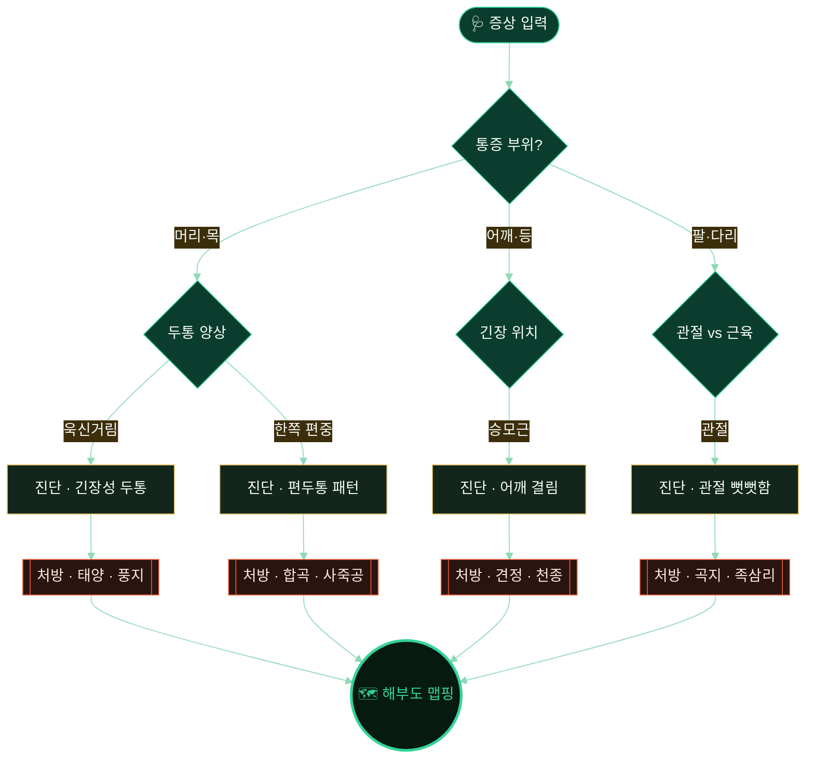

<!-- ╔═══════════════════════════════════════════════════════════════╗ -->
<!-- ║                      MERIDIAN SYMPTOM GUIDE                    ║ -->
<!-- ╚═══════════════════════════════════════════════════════════════╝ -->

<div align="center">

<a href="https://github.com/thejmh/MSG">
  
</a>

<br/>

<a href="https://readme-typing-svg.demolab.com">
  
</a>

<br/><br/>

<!-- ◍ meridian badge row ◍ -->


<br/>


</div>

<br/>

> **경락(經絡)의 지혜를, 알고리즘의 확실성으로.**
> MSG는 증상을 **결정론적 논리망**으로 진단하고, 고해상도 인체 해부도 위에
> 정확한 **지압점(경혈)** 위치를 짚어주는 완전 클라이언트-사이드 웹 애플리케이션입니다.
> LLM에 의존하지 않으므로 **같은 증상엔 언제나 같은 결과** — 환각도, 서버도, 비용도 없습니다.

<br/>

---

## ◉ 왜 MSG인가

> [!IMPORTANT]
> 건강 정보를 다루는 도구에서 **재현성**은 타협 대상이 아닙니다.
> 생성형 AI는 같은 질문에도 매번 다른 답을 내놓고, 존재하지 않는 혈자리를 지어낼 수 있습니다.
> MSG는 그 리스크를 **아키텍처 차원에서 제거**합니다.

<div align="center">

|  | 🤖 생성형 AI 진단 | 🧭 **MSG 결정론적 진단** |
|:--|:--:|:--:|
| **재현성** | 매번 다른 답변 | ✅ 동일 입력 → 동일 결과 |
| **환각 위험** | 없는 혈자리 생성 가능 | ✅ 정의된 데이터만 참조 |
| **동작 환경** | 서버·API 키 필요 | ✅ 100% 브라우저 로컬 |
| **오프라인** | 불가 | ✅ PWA 완전 지원 |
| **운영 비용** | 토큰당 과금 | ✅ **₩0** |
| **감사 추적** | 블랙박스 | ✅ 논리 경로 100% 투명 |

</div>

<br/>

## ◉ 시그니처 — 진단 논리망 (Deterministic DAG)

MSG의 심장은 **10개 노드의 방향성 비순환 그래프(DAG)** 입니다.
사용자의 응답은 트리를 따라 **하나의 확정된 경로**로 흐르며, 26개 증상 진단과
그에 매핑된 경혈 처방으로 귀결됩니다. 분기(分岐)마다 결과가 결정되어 있어
같은 길을 걸으면 같은 곳에 도착합니다.



> [!NOTE]
> 위 그래프는 실제 `logic-tree.json` 구조를 단순화해 시각화한 예시입니다.
> 전체 트리는 **10 노드 → 26 증상 → 361 경혈 좌표**로 확장됩니다.

<br/>

## ◉ 핵심 기능

<table>
<tr>
<td width="50%" valign="top">

### 🧭 결정론적 진단
LLM 없이 순수 수학적 의사결정 트리(DAG)로 동작.
**환각 위험 0%**, 모든 진단 경로가 추적 가능합니다.

</td>
<td width="50%" valign="top">

### 🫀 인터랙티브 해부도
머리·가슴·등·팔·다리 **5개 부위**의 고해상도 일러스트.
다크모드에 최적화되어 경혈점이 선명하게 대비됩니다.

</td>
</tr>
<tr>
<td width="50%" valign="top">

### 📴 완전 오프라인
Service Worker 기반 PWA. 한 번 로드하면
**네트워크 없이도** 전 기능이 동작합니다.

</td>
<td width="50%" valign="top">

### 💸 인프라 비용 ₩0
서버·DB·API 키가 필요 없습니다.
모든 연산이 **브라우저 로컬**에서 끝납니다.

</td>
</tr>
<tr>
<td width="50%" valign="top">

### 📱 네이티브 패키징
**Capacitor** 연동으로 iOS·Android 앱으로
그대로 빌드할 수 있습니다.

</td>
<td width="50%" valign="top">

### 🐳 Docker 원클릭
복잡한 로컬 세팅 없이 컨테이너 하나로
어디서든 동일하게 배포됩니다.

</td>
</tr>
</table>

<br/>

## ◉ 기술 스택

<div align="center">

| 레이어 | 기술 | 역할 |
|:--:|:--|:--|
| **Framework** | `Angular 21` | 단일 SPA 애플리케이션 셸 |
| **Language** | `TypeScript 5.x` | 타입 안전 로직 계층 |
| **Styling** | `TailwindCSS v4` | 유틸리티 우선 다크 UI |
| **Delivery** | `PWA · Service Worker` | 오프라인 캐싱 & 설치형 앱 |
| **Native** | `Capacitor` | iOS / Android 네이티브 래핑 |
| **Deploy** | `Docker` | 컨테이너 배포 |

</div>

<br/>

## ◉ 데이터 아키텍처

MSG는 **데이터 주도(data-driven)** 설계입니다. 로직과 콘텐츠가 JSON으로 분리되어,
코드를 건드리지 않고도 진단 규칙과 경혈 데이터를 확장할 수 있습니다.

```text
public/
├── ◍ logic-tree.json      # 10-노드 진단 경로 그래프 (DAG)
├── ◍ diagnostics.json     # 26개 증상 → 경혈 처방 매핑 테이블
├── ◍ acupoints.json       # 361개 경혈 좌표 데이터
└── ◍ *_anatomy.png        # 부위별 해부도 (head · chest · back · arms · legs)

src/app/
├── components/            # 진단 · 해부도 맵핑 · 경혈 상세 UI
└── services/              # 데이터 페칭 로직

Dockerfile                # 컨테이너 정의
doc/                      # 설계 문서 & 빌드 가이드
```

<br/>

## ◉ 빠른 시작

### 🐳 Docker (권장)

```bash
# 1. 이미지 빌드
docker build -t msg-angular-app .

# 2. 컨테이너 실행
docker run -d -p 3000:3000 --name msg-app msg-angular-app

# 3. 브라우저에서 열기
#    → http://localhost:3000
```

### 📱 모바일 빌드 (Capacitor)

네이티브 iOS / Android 패키징은 Capacitor로 지원됩니다.
자세한 절차는 [`doc/BuildGuide.md`](doc/BuildGuide.md)를 참고하세요.

<br/>

---

<div align="center">

### 경혈은 몸이 그려둔 지도. MSG는 그 지도를 읽어줄 뿐입니다. ◉

<sub>본 프로젝트는 정보 제공용 도구이며, 전문 의료 진단을 대체하지 않습니다.</sub>

<br/>


</div>
